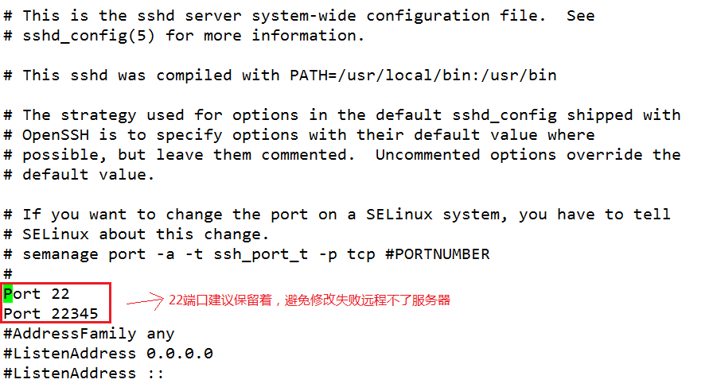
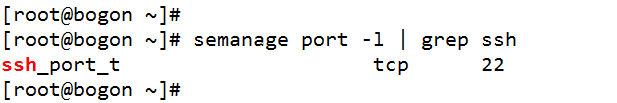
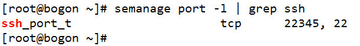

# CentOS 7修改SSH端口

## 一、修改ssh配置文件sshd_config

    [root@bogon ~]# vi /etc/ssh/sshd_config



## 二、防火墙放行

```
[root@bogon ~]# firewall-cmd --zone=public --add-port=22345/tcp --permanent
[root@bogon ~]# firewall-cmd --reload
```

## 三、向SELinux中添加修改的SSH端口

先安装SELinux的管理工具 `semanage` (如果已经安装了就直接到下一步) ：

    [root@bogon ~]# yum provides semanage

安装运行semanage所需依赖工具包 `policycoreutils-python`：

    [root@bogon ~]# yum -y install policycoreutils-python

查询当前 ssh 服务端口：

    [root@bogon ~]# semanage port -l | grep ssh



向 SELinux 中添加 ssh 端口：

    [root@bogon ~]# semanage port -a -t ssh_port_t -p tcp 22345



 重启 ssh 服务：

    [root@bogon ~]# systemctl restart sshd.service

测试成功后，把22端口注释掉即可。
